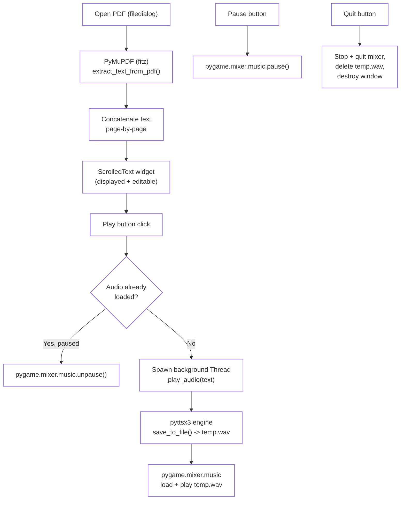

# PolyGlotter (PDF Text Player)

A Tkinter desktop app that opens a PDF, extracts its text, and reads it aloud using offline text-to-speech — with play/pause controls and non-blocking audio playback via a background thread.

---

## Architecture



**Flow summary:**
1. **Open PDF** triggers a file picker; the selected PDF is opened with `PyMuPDF` (`fitz`), and text is extracted page-by-page and concatenated.
2. The extracted text is loaded into a `ScrolledText` widget, where it can be viewed or edited before playback.
3. **Play** triggers TTS synthesis: `pyttsx3` renders the text box's current content to a `temp.wav` file, which is then loaded and played through `pygame.mixer`. This synthesis + playback step runs on a **separate `Thread`**, so the Tkinter UI stays responsive while audio is generated and played.
4. **Pause** pauses playback via `pygame.mixer.music.pause()`, and a subsequent **Play** resumes with `unpause()` rather than re-synthesizing.
5. **Quit** stops and tears down the mixer, deletes the temporary `.wav` file, and closes the window cleanly.

---

## Features

- **PDF text extraction** — full-document text extraction via `PyMuPDF` (`fitz`), page by page.
- **Editable text view** — extracted text is shown in a scrollable, editable text box before playback.
- **Offline text-to-speech** — `pyttsx3` synthesizes speech locally (no internet required).
- **Non-blocking playback** — TTS synthesis and audio playback run on a background `Thread`, keeping the UI responsive.
- **Play / Pause / Resume** — pause and resume playback without restarting or re-synthesizing audio.
- **Clean shutdown** — temporary audio file and mixer resources are released on quit.

---

## Requirements

```
PyMuPDF     # imported as `fitz`
pyttsx3
pygame
```

Install with:
```bash
pip install pymupdf pyttsx3 pygame
```

> `tkinter` and `threading` are part of the Python standard library — no separate install needed.

---

## Running the App

```bash
python text_player_app.py
```

1. Click **Open PDF** and select a PDF file.
2. The extracted text appears in the text box (editable if you want to trim/adjust before playback).
3. Click **Play** to start reading aloud.
4. Click **Pause** to pause, and **Play** again to resume from where you paused.
5. Click **Quit** to stop playback, clean up, and close the app.

---

## Important Implementation Notes

- **Why threading matters here**: `pyttsx3.engine.save_to_file()` + `runAndWait()` can take a few seconds for longer PDFs. Running this on the main thread would freeze the Tkinter event loop; running it in a `Thread` (as done in `play_audio`) keeps the window responsive during synthesis.
- **Play vs. Resume logic**: `play_text()` distinguishes three states — not yet loaded (spawn a new synthesis thread), paused (unpause in place), and already playing (no-op) — via the `audio_loaded` / `is_paused` flags.
- **Single temp file reused**: audio is always written to a fixed `temp.wav` path rather than a uniquely named temp file; this is simple but means only one PDF's audio can be "in flight" at a time, and a leftover `temp.wav` from a crashed run could be overwritten silently on the next play.
- **Thread is not tracked/joined on quit**: `quit_app()` stops the mixer and deletes `temp.wav`, but doesn't explicitly join `self.audio_thread`. In practice this is fine since `pygame.mixer.quit()` halts playback, but it's worth keeping in mind if you extend this with more complex background work.
- **Volume is fixed** at `0.5` in `play_audio`; there's no UI control for volume in this version.

---

## Known Limitations

- No playback speed or voice selection controls in this version (contrast with the translation-focused `Speechify App` module, which adds language/voice/speed options but only accepts typed text, not PDFs).
- Only one audio file can be active at a time (fixed `temp.wav` filename, no queuing).
- No visual progress indicator (e.g., page or time elapsed) during playback.
